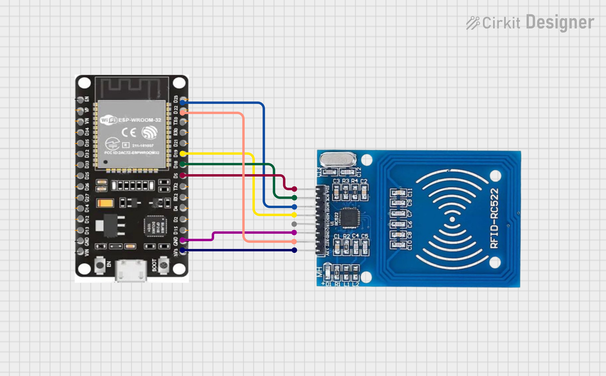

# RFID based virtual music library

The goal of this project is to create a ESPHome based RFID reader that can be used to automatically trigger events in Home Assistant. With the subgoal to have a physical system that can be used to turn on and switch between multiple music playlists, similar to CD's.

## Hardware
- ESP32 dev board
- RC522 RFID reader

## Wiring 

# What is implemented
- Minimal working hardware demo for RFID tags being placed on and being removed from the sensor
- Blueprint that can be used to easily link tags to (Spotify) playlists
- Shuffle the target playlists
- Joining multiple audio sources automatically from the blueprint

# What is being worked on
- Support for other audio sources
- Media controls on the esp device
- 3d printable case for the system
- 3d printable cartridges for the music
- Guidlines on tags that are supported
- Environmental sensors that can be added to the device